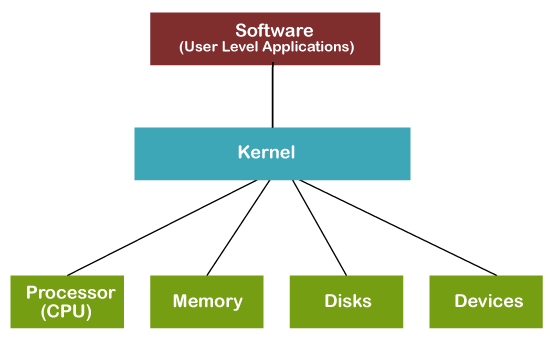
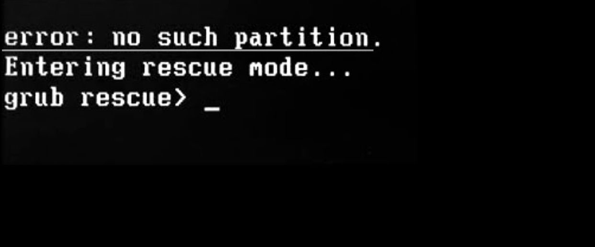

## INDEX
- [Boot & Reboot](#Boot--Reboot)
- [Boot Disk](#Boot-Disk)
- [firmware](#firmware)
- [Bootloader](#Bootloader)
- [kernel](#kernel)
- [device driver](#device-driver)
- [GNU](#GNU)
- [GRUB](#GRUB)
- [CLI & GUI](#CLI--GUI)
- [Unity](#Unity)
- [GNOME](#GNOME)_______________yet to publish 
- [Terminal/Console]()____yet to publish 
- [ROOT](#ROOT)________________yet to publish 
- [Binaries](#Binaries)____________yet to publish 
- [Package Manager](#Package-Manager)_____yet to publish 
- [apt-get and rpm]()_____yet to publish 

 
 

## Boot & reboot

In computing, booting is the process of starting a computer. It can be initiated by hardware such as a button press, or by a software command.

In computing, rebooting is the process by which a running computer system is restarted, either intentionally or unintentionally

 

## Boot Disk 

Alternatively referred to as a startup disk, system disk, master disk, or bootabledisk, a boot disk is a storage device that contains special files required for the computer to boot into an operating system. It can be CD, HDD, USB or any other.
If the bootable disk is removable media (e.g., USB or CD-ROM), it bypasses the hard drive, depending on the settings in the BIOS. This diskette is most often used to troubleshoot the computer or allow the user to copy files when a computer is down.

 

## Firmware

Firmware is a software program or set of instructions programmed on a hardware device. It provides the necessary instructions for how the device communicates with the other computer hardware. It is typically stored in the flash ROM of a hardware device. While ROM is "read-only memory," flash ROM can be erased and rewritten because it is actually a type of flash memory.

Every electronic devices `e.g. microwave oven, AC, TV, Washing machine` which have microcontroller must need a software to run it. I case of computer this Firmware is called <b>`BIOS`</b> or <b>`UFEI`</b>. which is stored in a BIOS chip inside it.

 

## Bootloader
A bootloader is the first software that runs when a computer starts. It is typically started after the computer or the BIOS have finished performing the initial power and hardware device checks and tests.  It fetches the <b>`kernel`</b> from the hard disk or any specified boot device within the boot sequence, into the main memory.

An operating system can have single bootloader or multiple boot loader programs classified as primary and secondary boot loaders, where a secondary boot loader might be larger and more capable than the primary boot loader.

 

## Kernel

Basically It's a kind of bridge between Hardware and Software. 
The kernel is the most important part of the operating system. It is the primary interface between the hardware and the processes of a computer. The kernel connects these two in order to adjust resources as effectively as possible.

While starting a computer after bootloader loads the kernel in computer's RAM then it (the kernel) initializes the rest of the operating system: shell, display manager, desktop environment, etc.

[know more](https://en.wikipedia.org/wiki/Kernel_(operating_system))

 

## device driver

A device driver is a small piece of software that tells the operating system and other software how to communicate with a piece of hardware. 
For example, printer drivers tell the operating system, and by extension whatever program you have the thing you want to print open in, exactly how to print information on the page

[know more](https://en.wikipedia.org/wiki/Device_driver)

 

## GNU

GNU stands for '`GNU's Not UNIX`'. It is a UNIX like computer operating system, but unlike UNIX, it is free software and contains no UNIX code. It is pronounced as guh-noo. Sometimes, it is also written as GNU General Public License. It is based on the GNU Hurd kernel and It is intended to develop and share software for free, for all its users.

[know more](https://www.gnu.org/gnu/gnu-history.en.html)

 

## GRUB

`Grand Unified Bootloader` or `GRUB` is a bootloader available from the GNU project. It is a complete program for loading and managing the boot process. It is the most common bootloader for Linux distributions.

If there occuers any trouble before loading the kernel, computer will enter in grub rescue mode shell where user have operate manually for further process of booting.

we will discuss about it's trouble shoot later.

 
 

[know more](https://www.gnu.org/software/grub/index.html)

 

## CLI & GUI

If we want to operate a machine we need a interface through which we can give instructions as input and get result as output. In computer we have two type of interface <b>CLI (Command Line Interface)</b> and <b>GUI (Graphical User Interface)</b>

- CLI - you may have seen a dark screen where where user have to put command to perform any task. Here we don't have any button or graphical design, e.g. <b>Comand Prompt, PowerShell, BASH </b>. The program which handles this interface is called a command-line interpreter or command-line processor. 
[know more](https://en.wikipedia.org/wiki/Command-line_interface)

- GUI - A graphical user interface is an interface program that allows users to interact with a computer through its graphic display like button, slide bar, icons, pointer etc. Everyting what you can interact with mouse except terminal is GUI.

 

## Unity

Unity is a graphical shell for the GNOME desktop environment originally developed by Canonical Ltd. for its Ubuntu operating system, and now being developed by the Unity7 Maintainers and UBports. Unity debuted in the netbook edition of Ubuntu 10.10.

[know more](https://www.omgubuntu.co.uk/2017/04/best-unity-desktop-features)
